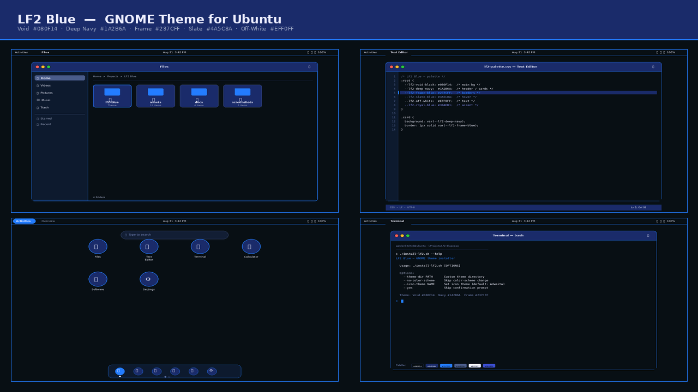
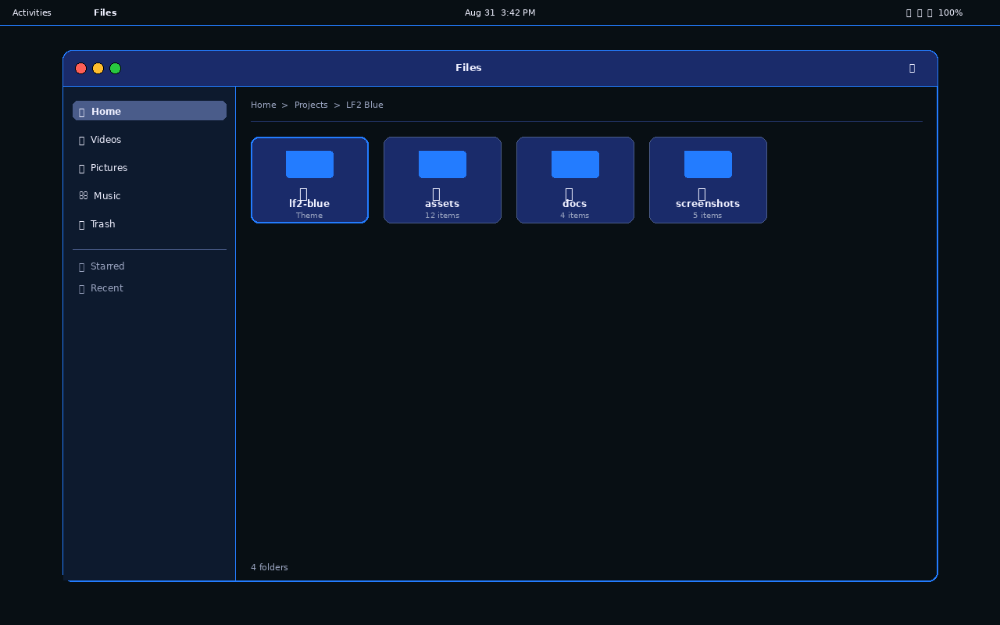
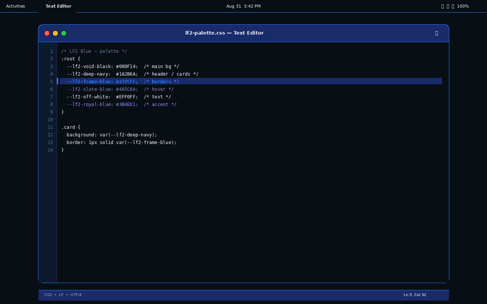
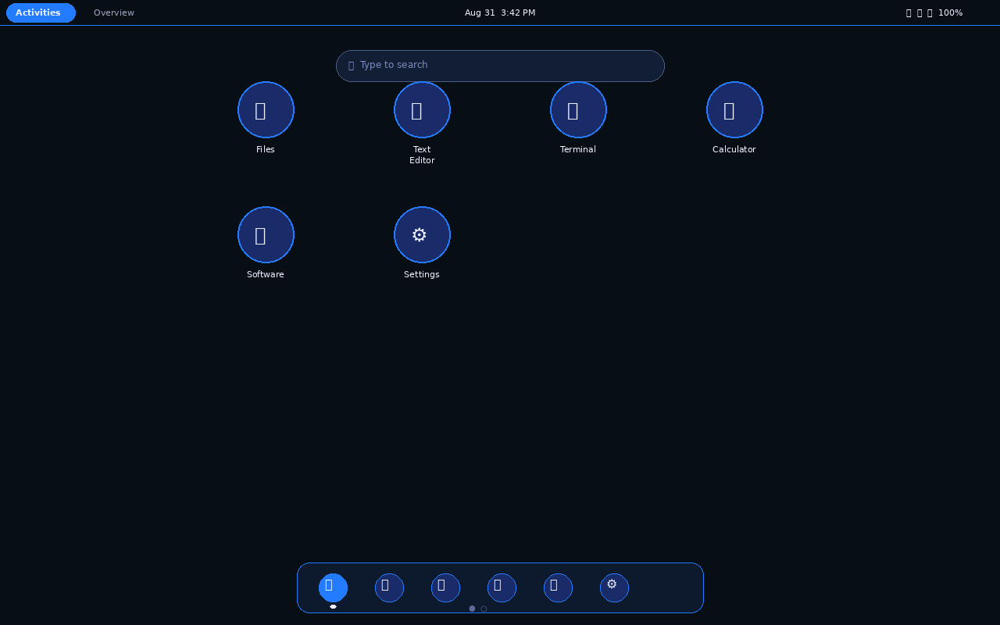
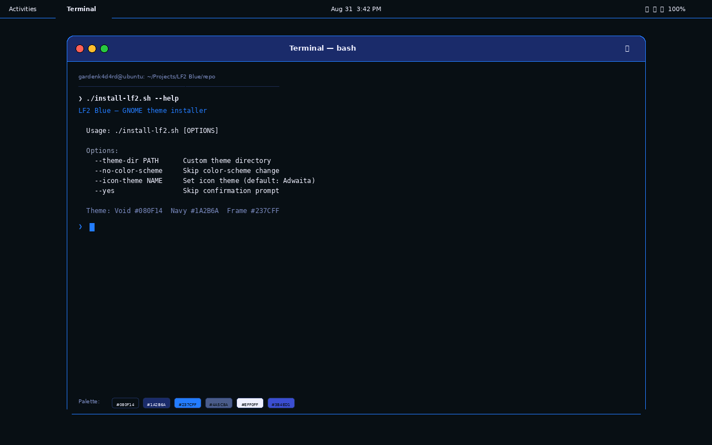

# LF2 Blue

A dark blue desktop theme for GNOME (Ubuntu / GNOME 50), originally built as a GNOME
Shell + GTK theme, now packaged as a **standalone, shareable installer** so anyone can
apply it without extra tooling or a running background service.

## Features

- Themes **GTK3**, **GTK4/libadwaita** (Settings, Files, …), and the **GNOME Shell**
- **No dependencies** — no Rewaita, no daemon. Writes CSS to the locations Gnome
  auto-loads.
- **Idempotent** installer + **full rollback** uninstaller via timestamped backups
- **Reproducible** — the theme is generated from checksum-pinned sources by
  `schema/build/build.py`, byte-identical to what's shipped.

## What's here

```
LF2 Blue/
├── LICENSE                      # GPL-3.0-or-later
├── README.md                    # this file
├── lf2-palette.css              # the LF2 Blue palette as ready-to-use CSS custom properties
├── screenshots/                 # generative mock previews (hero + 4 shots)
├── schema/                      # source of truth — reproducibility + build pipeline
│   ├── README.md                # schema manifest
│   ├── checksum.sh              # verify + rebuild + diff pipeline
│   ├── checksums.txt            # SHA-256 manifest
│   ├── sources/                 # locked canonical inputs (Rewaita templates + LF2 theme)
│   ├── build/build.py           # replicates Rewaita's exact build logic
│   └── out/                     # regenerated artifacts (byte-identical to installer)
└── installer/
    ├── README.md                # installer documentation
    ├── install-lf2.sh           # standalone installer
    ├── uninstall-lf2.sh         # full rollback uninstaller
    └── themes/lf2-blue/
        ├── gtk-4.0/gtk.css              # GTK4 / libadwaita (variable sheet)
        ├── gtk-3.0/gtk.css              # GTK3 (template, palette substituted)
        └── gnome-shell/gnome-shell.css  # GNOME Shell (template + accent-tabs)
```

See `installer/README.md` for full install/uninstall instructions.

## Install

```bash
cd installer
./install-lf2.sh
```

Log out and back in to restyle the shell; newly-launched apps pick the theme up
immediately. To roll back:

```bash
./uninstall-lf2.sh
```

## Screenshots

> **Note:** Mock previews generated to showcase the palette without exposing personal files. Real GTK4/GTK3/Shell rendering is byte-identical (`schema/checksum.sh`).



| Files (Nautilus) | Text Editor |
|---|---|
|  |  |

| Overview (Shell) | Terminal |
|---|---|
|  |  |

Individual shots: [`01-files.png`](screenshots/01-files.png) · [`02-editor.png`](screenshots/02-editor.png) · [`03-overview.png`](screenshots/03-overview.png) · [`04-terminal.png`](screenshots/04-terminal.png) · [`hero.png`](screenshots/hero.png)

## The palette

| Token | Hex | Role |
|-------|-----|------|
| Void Black | `#080F14` | main background, content surfaces |
| Deep Navy | `#1A2B6A` | banners, cards, popovers, dialogs |
| Frame Blue | `#237CFF` | borders, separators, structure, active accents |
| Slate Blue | `#4A5C8A` | hover, selection |
| Off-White | `#EFF0FF` | primary text / titles |
| Royal Blue | `#3B4ED1` | accent fallback |

```css
/* import then use any token */
body  { background: var(--lf2-void-black); color: var(--lf2-off-white); }
.card { background: var(--lf2-deep-navy); border: 1px solid var(--lf2-frame-blue); }
a:hover { color: var(--lf2-slate-blue); }
```

Rendered via `lf2-palette.css`.

## How it works

GTK and GNOME Shell auto-load per-user CSS files, so the installer just writes:

- `~/.config/gtk-4.0/gtk.css` — GTK4 / libadwaita apps (variable sheet; libadwaita
  consumes the CSS variables to theme Settings/Files)
- `~/.config/gtk-3.0/gtk.css` — GTK3 apps (template with the palette substituted)
- `~/.local/share/themes/lf2-blue/gnome-shell/gnome-shell.css` — GNOME Shell via the
  User Themes extension

…and flips `color-scheme` to `prefer-dark`. No Rewaita or background daemon required.
A full uninstaller restores your prior setup from a timestamped backup.

## Development / verification

The theme is validated end-to-end so it never touches a production desktop:

- **Fake `gsettings` shim + isolated `HOME`** — the installer/uninstaller can be
  dry-run safely, and every write/revert is verified.
- **Throwaway Linux user** — a real session-level install confirmed all three surface
  types (`GTK3`, `GTK4/libadwaita`, and the Shell) load and render correctly, then the
  user was deleted.
- **Reproducibility** — `schema/checksum.sh` verifies the checksum-pinned sources,
  regenerates the artifacts, and diffs them byte-for-byte against the shipped
  `installer/themes/lf2-blue/` CSS. All three always match.

## License

This project is licensed under the **GNU General Public License v3.0 or later**
([LICENSE](LICENSE)).

### Attributions

The theme CSS artifacts (`installer/themes/lf2-blue/`) were generated by
[**Rewaita**](https://github.com/SwordPuffin/Rewaita) by Nathan Perlman (SwordPuffin),
licensed under **GPL-3.0-or-later**. The build pipeline in `schema/build/build.py`
replicates Rewaita's output for the LF2 v0.3 theme standalone, without requiring
Rewaita at runtime.

- Rewaita source: <https://github.com/SwordPuffin/Rewaita>
- License: GNU General Public License v3.0 or later
- Top contributors: SwordPuffin, psypherium, imqinyu, Vistaus, Alexmelman88, and others
  ([full list](https://github.com/SwordPuffin/Rewaita/graphs/contributors))

The `rewaita-css_templates.py` and template CSS files in `schema/sources/` retain
their original GPL-3.0-or-later headers as required by the license.

The LF2 v0.3 theme (`schema/sources/lf2-blue-theme.css`), the LF2 Blue palette,
the installer/uninstaller scripts, the ASCII logo, and `build/build.py` are
original work by **gardenk4d4rd**.

### Scope

- Themed output covers the standard GTK3/GTK4 + GNOME Shell surfaces.
- **Electron** apps that ship their own theming are out of scope.
